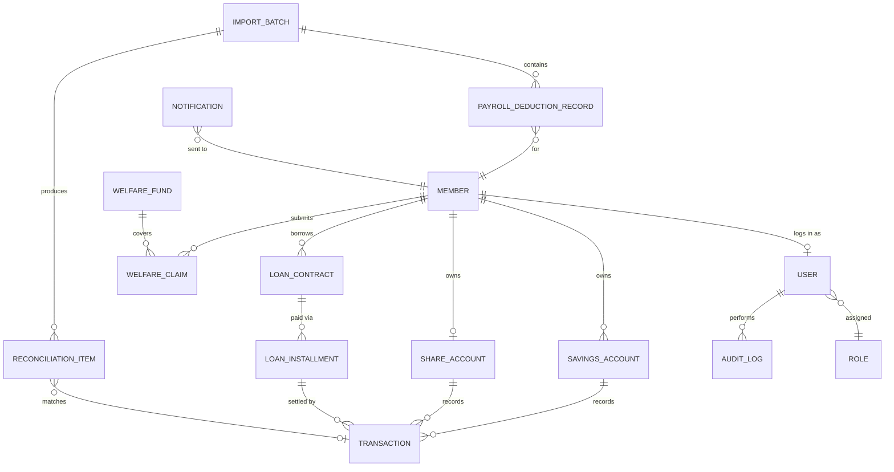

# 3. แบบจำลองข้อมูล (Entity-Relationship ระดับสูง)

เอกสารนี้แสดงเฉพาะ entity หลักและความสัมพันธ์ระดับสูง ไม่ใช่ full database schema — ใช้เป็นจุดเริ่มต้นสำหรับออกแบบฐานข้อมูลจริงในเฟสพัฒนา

## 3.1 รายการ Entity หลัก

| Entity | คำอธิบาย |
|---|---|
| **สมาชิก (Member)** | ข้อมูลส่วนบุคคล, สถานะสมาชิกภาพ, ต้นสังกัด |
| **บัญชีเงินฝาก (SavingsAccount)** | บัญชีออมทรัพย์/ออมทรัพย์พิเศษ/ประจำ ผูกกับสมาชิก 1 คน |
| **บัญชีหุ้น (ShareAccount)** | ยอดหุ้นสะสมของสมาชิกแต่ละคน |
| **สัญญาเงินกู้ (LoanContract)** | สัญญากู้แต่ละฉบับ พร้อมประเภท วงเงิน อัตราดอกเบี้ย ผู้ค้ำประกัน |
| **งวดชำระ (LoanInstallment)** | ตารางผ่อนชำระรายงวดของแต่ละสัญญาเงินกู้ |
| **ธุรกรรม (Transaction)** | รายการฝาก/ถอน/ชำระงวด/ซื้อหุ้น ทุกประเภท เชื่อมกับบัญชีต้นทาง |
| **กองทุนสวัสดิการ (WelfareFund)** | ประเภทกองทุน (ฌกส./ทุนการศึกษา/รักษาพยาบาล) และเงื่อนไขสิทธิ์ |
| **คำขอสวัสดิการ (WelfareClaim)** | คำขอรับสิทธิสวัสดิการของสมาชิก พร้อมสถานะการพิจารณา |
| **รายการหักเงินเดือน (PayrollDeductionRecord)** | ยอดที่ขอหักและยอดที่หักจริงต่อสมาชิกต่อเดือน |
| **ไฟล์นำเข้า (ImportBatch)** | บันทึกการนำเข้าไฟล์หักเงินเดือน/statement ธนาคาร/รายการโอนสมาชิก แต่ละครั้ง |
| **รายการกระทบยอด (ReconciliationItem)** | ผลการจับคู่รายการนำเข้ากับธุรกรรมในระบบ (จับคู่แล้ว/รอตรวจสอบ) |
| **ผู้ใช้งาน/บทบาท (User/Role)** | บัญชีผู้ใช้เจ้าหน้าที่และสมาชิก พร้อมบทบาทและสิทธิ์ |
| **บันทึกตรวจสอบ (AuditLog)** | ประวัติการสร้าง/แก้ไข/ลบข้อมูลสำคัญทั้งหมด |
| **ประกาศ/การแจ้งเตือน (Notification)** | ข้อความที่ส่งถึงสมาชิก พร้อมช่องทางและสถานะการส่ง |

## 3.2 ความสัมพันธ์ระดับสูง (Mermaid ER Diagram)

## 3.3 หมายเหตุการออกแบบ

- `Transaction` เป็น entity กลางที่เชื่อมทุกความเคลื่อนไหวทางการเงิน เพื่อให้ audit trail และรายงานทางการเงิน (โมดูล 2.3) ดึงข้อมูลจากแหล่งเดียว ลดความเสี่ยงยอดไม่ตรงกันระหว่างรายงาน
- `ReconciliationItem` ออกแบบให้ผูกกับ `Transaction` แบบ optional (`}o--o|`) เพราะช่วงแรกหลังนำเข้าไฟล์อาจยังไม่มีธุรกรรมที่จับคู่ได้ ต้องรอเจ้าหน้าที่ตรวจสอบด้วยมือ
- `PayrollDeductionRecord` แยกจาก `Transaction` เพราะเป็น "ยอดที่ขอหัก" ซึ่งอาจไม่ตรงกับ "ยอดที่หักจริง" — ส่วนต่างคือสิ่งที่โมดูล 2.5 ต้องเปิดเผยให้เจ้าหน้าที่เห็น
- รายละเอียด field ระดับคอลัมน์ (data type, constraint, ดัชนี) จะออกแบบในเฟสพัฒนาจริงเมื่อทราบรูปแบบไฟล์ต้นสังกัด/ธนาคารที่แน่ชัด (ดู [07-ข้อสมมติฐานที่ต้องยืนยัน.md](07-ข้อสมมติฐานที่ต้องยืนยัน.md))
